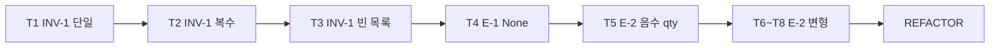

# 테스트 플랜 — INV-1, E-1, E-2

| 항목 | 내용 |
|------|------|
| **문서 버전** | 1.0 |
| **작성일** | 2026-06-24 |
| **근거** | [README.md](../README.md) 계약표, [AGENTS.md](../AGENTS.md) ECB·TDD 워크플로 |
| **범위** | INV-1 (Entity), E-1·E-2 (Boundary*) |
| **단계** | RED 진입 — 구현 미착수 |

---

## 1. 목적

본 문서는 장바구니 할인 계산기의 **첫 TDD 사이클** 대상 계약에 대한 테스트 설계를 정의한다.

| ID | 계약 | 계층 |
|----|------|------|
| INV-1 | `subtotal(items) == Σ(price × qty)` | Entity |
| E-1 | `items is None → TypeError` | Boundary* |
| E-2 | `price` 또는 `qty`가 음수 → `ValueError`, **인덱스 포함** | Boundary* |

계약 ID가 테스트·구현을 잇는 추적 못(pin)이다. **ID에 없는 동작은 테스트하지 않는다.**

---

## 2. 전제·용어

### 2.1 데이터 형식

README·PRD 실주문 사례(AC-3)에 맞춰, `items`는 `(price, qty)` 튜플의 시퀀스로 가정한다.

```python
items = [(12_000, 3), (30_000, 1)]  # price: int(원), qty: int
```

- `subtotal(items: Sequence[tuple[int, int]]) -> int` — 대상 함수(이름은 GREEN 단계에서 `src/cart.py`에 확정).
- Flask·HTTP는 **본 플랜 범위 밖**. E-1·E-2는 README §Boundary*에 따라 **도메인 함수 진입점**에서 검증한다.

### 2.2 테스트 디렉터리 (ECB)

| 계약 | 테스트 위치 | 비고 |
|------|-------------|------|
| INV-1 | `tests/entity/` | 순수 합산 불변식 |
| E-1, E-2 | `tests/boundary/` | 입력 검증; 현재는 `subtotal` 호출로 대리 |

향후 `src/app.py`(Flask)가 생기면 Boundary 테스트는 HTTP 계층으로 이전하되, **계약 ID는 동일**하게 유지한다.

### 2.3 TDD 제약

| 단계 | 수정 범위 | 완료 조건 |
|------|-----------|-----------|
| RED | `tests/` 만 | 해당 계약 테스트가 **의도적으로 실패** |
| GREEN | `src/` | 최소 구현 + 구현 줄에 `# INV-1` / `# E-1` / `# E-2` 주석 |
| REFACTOR | 구조 정리 | 리팩터 전후 `pytest -q` 동작 불변 |

- `assert True`, `pytest.skip`, 기존 테스트 삭제·비활성화 **금지**.
- 구조 변경과 동작 변경은 **커밋 분리** (test → feat → refactor).

---

## 3. 권장 파일 구조

```text
tests/
├── entity/
│   └── test_subtotal_inv_1.py    # INV-1
└── boundary/
    └── test_subtotal_e_1_e_2.py  # E-1, E-2
src/
└── cart.py                       # GREEN 단계에서 생성
```

---

## 4. INV-1 — 소계 합산 (Entity)

### 4.1 계약

```
subtotal(items) == Σ(price × qty)   for each (price, qty) in items
```

할인·VIP·문턱은 **범위 밖**. 소계만 검증한다.

### 4.2 테스트 케이스

| # | ID | 시나리오 | 입력 `items` | 기대 `subtotal` | RED 시 실패 이유 |
|---|-----|----------|--------------|-----------------|------------------|
| T1 | INV-1 | 단일 품목 | `[(10_000, 2)]` | `20_000` | 함수 미구현 / 항상 0 |
| T2 | INV-1 | 복수 품목 | `[(12_000, 3), (30_000, 1)]` | `66_000` | AC-3 소계; 합산 오류 |
| T3 | INV-1 | 빈 목록 | `[]` | `0` | 빈 합의 정의 미구현 |

**의도적으로 포함하지 않음 (OOS):**

- 음수 `price`/`qty` → E-2 전용
- `items is None` → E-1 전용
- `qty == 0`, 소수 원, 할인 적용

### 4.3 예시 테스트 (RED)

```python
# tests/entity/test_subtotal_inv_1.py
from cart import subtotal


def test_inv_1_single_item():
    assert subtotal([(10_000, 2)]) == 20_000  # INV-1


def test_inv_1_multiple_items_ac3_subtotal():
    assert subtotal([(12_000, 3), (30_000, 1)]) == 66_000  # INV-1, AC-3 소계


def test_inv_1_empty_items():
    assert subtotal([]) == 0  # INV-1
```

### 4.4 GREEN 최소 구현 가이드

```python
# src/cart.py
def subtotal(items):
    total = 0
    for price, qty in items:
        total += price * qty  # INV-1
    return total
```

검증(E-1, E-2)은 **별도 사이클**에서 추가한다. INV-1 GREEN만으로는 E 케이스가 통과하지 않아야 한다.

---

## 5. E-1 — None 입력 (Boundary*)

### 5.1 계약

```
items is None  →  TypeError
```

- 예외 **종류**가 `TypeError`임을 검증한다 (`ValueError` 아님).
- 메시지 문구는 계약에 고정되지 않았으므로, `pytest.raises(TypeError)`로 종류만 확인한다.

### 5.2 테스트 케이스

| # | ID | 시나리오 | 입력 | 기대 |
|---|-----|----------|------|------|
| T4 | E-1 | None 전달 | `subtotal(None)` | `TypeError` 발생 |

**근거:** CS 사례 — items 없이 제출 시 서버 500 (PRD §2.2). 도메인에서 조기 거부.

### 5.3 예시 테스트 (RED)

```python
# tests/boundary/test_subtotal_e_1_e_2.py
import pytest
from cart import subtotal


def test_e_1_items_none_raises_type_error():
    with pytest.raises(TypeError):
        subtotal(None)  # E-1
```

### 5.4 GREEN 최소 구현 가이드

`subtotal` **진입 직후**, 합산 전에 검사한다.

```python
def subtotal(items):
    if items is None:
        raise TypeError("items must not be None")  # E-1
    ...
```

---

## 6. E-2 — 음수 price/qty (Boundary*)

### 6.1 계약

```
price < 0 또는 qty < 0  →  ValueError (인덱스 정보 포함)
```

- 예외 종류: `ValueError`
- **인덱스 포함** — 메시지에 문제 품목의 0-based 인덱스가 드러나야 한다 (CS `qty=-1` 디버깅 용이성).
- 여러 품목 중 **첫 번째 위반 인덱스**에서 중단하는 것으로 충분하다 (계약에 “모든 위반 수집” 없음).

### 6.2 테스트 케이스

| # | ID | 시나리오 | 입력 | 기대 |
|---|-----|----------|------|------|
| T5 | E-2 | 음수 수량 | `[(12_000, -1)]` | `ValueError`, 메시지에 `0` |
| T6 | E-2 | 음수 단가 | `[(-100, 1)]` | `ValueError`, 메시지에 `0` |
| T7 | E-2 | 두 번째 품목 위반 | `[(10_000, 1), (5_000, -2)]` | `ValueError`, 메시지에 `1` |
| T8 | E-2 | price·qty 모두 음수 (인덱스 0) | `[(-1, -1)]` | `ValueError`, 메시지에 `0` |

**의도적으로 포함하지 않음:**

- `qty == 0` (OOS-8, PRD §9)
- 양수만 있는 정상 입력 (INV-1)

### 6.3 예시 테스트 (RED)

```python
def test_e_2_negative_qty_includes_index():
    with pytest.raises(ValueError, match=r"0"):
        subtotal([(12_000, -1)])  # E-2


def test_e_2_negative_price_includes_index():
    with pytest.raises(ValueError, match=r"0"):
        subtotal([(-100, 1)])  # E-2


def test_e_2_violation_at_second_item():
    with pytest.raises(ValueError, match=r"1"):
        subtotal([(10_000, 1), (5_000, -2)])  # E-2
```

메시지 형식 예 (구현 자유, 인덱스만 노출되면 됨):

- `"invalid qty at index 0"`
- `"item[1]: negative price"`

### 6.4 GREEN 최소 구현 가이드

```python
def subtotal(items):
    if items is None:
        raise TypeError(...)  # E-1
    for i, (price, qty) in enumerate(items):
        if price < 0 or qty < 0:
            raise ValueError(f"invalid item at index {i}")  # E-2
    ...
```

---

## 7. 권장 TDD 진행 순서

한 번에 하나의 **실패 테스트**만 추가하고 GREEN으로 통과시킨 뒤 다음으로 넘긴다.



| 순서 | RED 테스트 | GREEN 충족 ID |
|------|------------|---------------|
| 1 | T1 | INV-1 (루프·곱셈 최소) |
| 2 | T2 | INV-1 |
| 3 | T3 | INV-1 |
| 4 | T4 | E-1 |
| 5 | T5 | E-2 |
| 6 | T6–T8 | E-2 (인덱스·price 케이스) |
| 7 | — | REFACTOR (중복 검증 로직 정리 등) |

**커밋 예시:**

1. `test: add INV-1 subtotal failing tests (T1–T3)`
2. `feat: implement subtotal sum for INV-1`
3. `test: add E-1 None TypeError failing test`
4. `feat: reject None items for E-1`
5. `test: add E-2 negative value failing tests`
6. `feat: validate price/qty with index for E-2`
7. `refactor: extract item validation without behavior change`

---

## 8. 실행·완료 기준

### 8.1 명령

```bash
pytest tests/entity/test_subtotal_inv_1.py -q   # INV-1
pytest tests/boundary/test_subtotal_e_1_e_2.py -q  # E-1, E-2
pytest -q                                        # 전체 (본 플랜 완료 후)
```

### 8.2 Definition of Done

- [ ] T1–T8 전부 통과 (`pytest -q` 실패 0)
- [ ] `src/cart.py`에 INV-1·E-1·E-2 주석이 해당 구현 줄에 존재
- [ ] RED 단계에서 `src/` 미수정, GREEN에서만 `src/` 수정
- [ ] 할인·VIP·Flask·추가 예외 **미구현** (과잉 구현 없음)
- [ ] REFACTOR 후에도 T1–T8 결과 동일

---

## 9. 추적 매트릭스

| 테스트 ID | 계약 ID | 파일 | AC 연계 |
|-----------|---------|------|---------|
| T1 | INV-1 | `tests/entity/test_subtotal_inv_1.py` | — |
| T2 | INV-1 | 동일 | AC-3 (소계 66_000) |
| T3 | INV-1 | 동일 | — |
| T4 | E-1 | `tests/boundary/test_subtotal_e_1_e_2.py` | CS items 없음 제출 |
| T5–T8 | E-2 | 동일 | CS `qty=-1` |

---

## 10. 관련 문서

| 문서 | 설명 |
|------|------|
| [README.md](../README.md) | 계약 ID 권위 표 |
| [PRD.md](./PRD.md) | Discovery·AC·OOS 상세 |
| [AGENTS.md](../AGENTS.md) | ECB·RED/GREEN/REFACTOR 규칙 |

---

*본 문서는 docs/TEST_PLAN-INV-1-E-1-E-2.md — INV-1·E-1·E-2 테스트 플랜입니다.*
